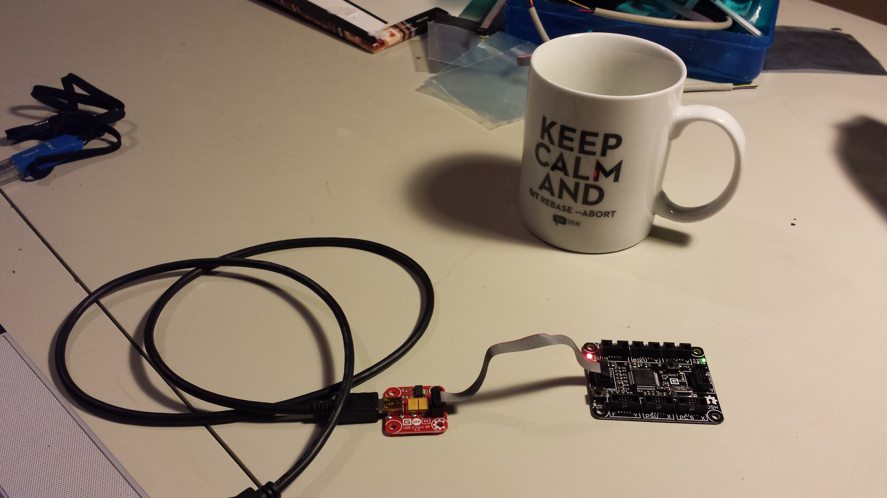

HelloFezCerberus
================

A "Hello world" application on the Fez Cerberus Gadgeteer mainboard.

Requirements
------------

You need to have a [Fez Cerberus Mainboard](https://www.ghielectronics.com/catalog/product/349) and a [USB Client SP](https://www.ghielectronics.com/catalog/product/33) in order to run the program. 
You also need to set up your software as described on the [.net gadgeteer get started page](http://www.netmf.com/gadgeteer/get-started.aspx).

Hardware setup
--------------

You have to connect the hardware module with the mainboard as it is shown in the `Program.gadgeteer` diagram (This is part of the code.). 

Here is a 

The result
----------

The viewable result of the running the code is that the green led light on the main board blinks (it switches from on to off or vice versa) every half second.

I have added a [video of the result](https://github.com/steenhulthin/HelloFezCerberus/blob/master/HelloFezCerberus.mp4).